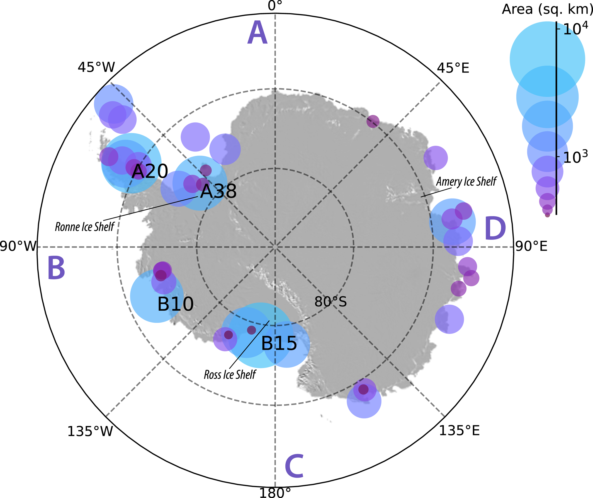

---

##### Download

+ [Paper](grl_evt.pdf)
+ [Code and data](https://github.com/jdmillstein/iceberg_evt)

---

##### Abstract

Massive calving events result in significant instantaneous ice loss from Antarctica. The rarity and stochastic nature of these extreme events makes it difficult to understand their physical drivers, temporal trends, and future likelihood. To address this challenge, we turn to extreme value theory to investigate past trends in annual maxima iceberg area and assess the likelihood of high-magnitude calving events. We use 47 years of iceberg size from satellite observations. Our analysis reveals no upward trend in the surface area of the largest annual iceberg over this time frame. This finding suggests that extreme calving events such as the recent 2017 Larsen C iceberg, A68, are statistically unexceptional and that extreme calving events are not necessarily a consequence of climate change. Nevertheless, it is statistically possible for Antarctica to experience a calving event up to several times greater than any in the observational record.

---

##### Map of the positions of the largest iceberg calving event in each year from 1976 to 2023

---

##### Related material

+ [Presentation at 2024 Community Earth System Model (CESM) Workshop](https://www.cesm.ucar.edu/events/351/agenda)

